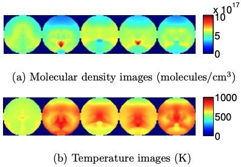
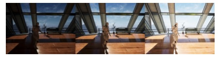
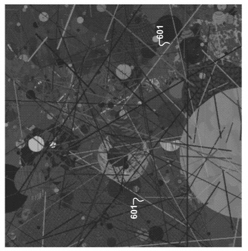
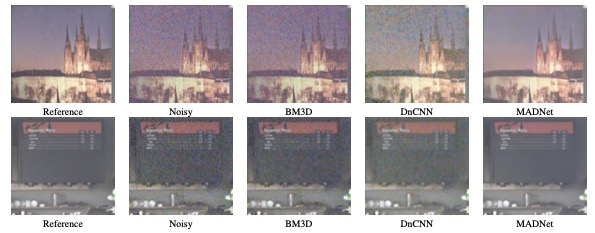
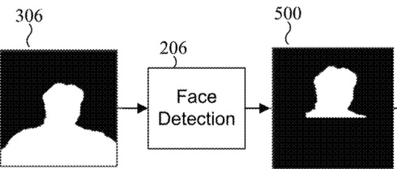

<!-- THIS is the front page of a website (which I will edit) that is powered by the [Academic Pages template](https://github.com/academicpages/academicpages.github.io) and hosted on GitHub pages. [GitHub pages](https://pages.github.com) is a free service in which websites are built and hosted from code and data stored in a GitHub repository, automatically updating when a new commit is made to the repository. This template was forked from the [Minimal Mistakes Jekyll Theme](https://mmistakes.github.io/minimal-mistakes/) created by Michael Rose, and then extended to support the kinds of content that academics have: publications, talks, teaching, a portfolio, blog posts, and a dynamically-generated CV. Incidentally, these same features make it a great template for anyone that needs to show off a professional template!

 You can fork [this template](https://github.com/academicpages/academicpages.github.io) right now, modify the configuration and Markdown files, add your own PDFs and other content, and have your own site for free, with no ads! -->

<!-- I am an imaging scientist with 10+ years of experience in deep learning, generative models, and numerical optimization for real-time imaging systems. Proven track record of designing, training, and deploying neural models under strict latency and performance constraints, and shipping AI-driven features used by millions of users. Deep expertise in neural rendering–adjacent pipelines, image/video generation, and performance-critical PyTorch/C++ systems, with strong cross-functional collaboration across hardware, systems, and product team -->

  

      
  

  

    

   I am an computational imaging scientist with <b>10+ years of experience </b> in computational photography, inverse problems, mathematical & statistical modelling, and deep learning. I am currently a staff engineer at Samsung Research America working on <b> night mode photography</b>. 
   <!-- I have a proven track record of developing commercial grade algorithms for smartphone cameras and have been involved in numerous projects collaborating with many prestigious institutions including Argonne national laboratory, and air force research labs (AFRL).  -->
   Recently I have been involved in projects on <b> generative AI </b> focusing on physics consistent and identity consistent content generation.
   I have hands on experience in developing performance critical Pytorch/Tensorflow/C++ systems with strong cross-functional collaboration across hardware, systems, and product teams.
     
  <a href="/assets/Zeeshan_Resume_Jan-24-2026" target="_blank" rel="noopener"> <strong>CV</strong></a> / 
  <a href="https://www.linkedin.com/in/zeeshan-nadir/" target="_blank"><strong>LinkedIn</strong></a> / 
  <a href="https://scholar.google.com/citations?view_op=list_works&hl=en&hl=en&user=lHj-_TkAAAAJ&sortby=pubdate/" target="_blank"><strong>Google Scholar</strong></a>.
    

  

<h1 style="margin-left:-250px;"><i><u>Selected Research Highlights</u></i></h1>

<!--  -->

<!-- ## *<u>Generative Models</u>* -->

<h2 style="margin-left:-250px;"><i><u>Generative AI</u></i></h2>

###  SeeU: Seeing the Unseen World via 4D Dynamics-aware Generation 

  <!-- 

    
  
 -->

  

    

     
    
 <b>Replacing object in the video using SeeU</b>

      <i> A novel 2D→4D→2D framework that reconstructs a continuous 4D world from sparse monocular video and learns its dynamics under low-rank and physical constraints.
      By modeling motion in continuous 4D space-time, SeeU generates physically consistent unseen views and unobserved time frames.
      </i> 
      <a href="https://arxiv.org/abs/2512.03350" target="_blank">[arXiv]</a> / 
      <a href="https://huggingface.co/datasets/pandaphd/SeeU45" target="_blank"> [Dataset]</a> / 
      <a href="https://github.com/pandayuanyu/SeeU" target="_blank"> [Code]</a>.

  

###  Physics-Consistent and Controllable Text-to-Video Generation via Neural Newtonian Dynamics 

  <!-- 

    
  
 -->

  

    

     
    
 Replacing object in the video using SeeU.

      <i> A novel 2D→4D→2D framework that reconstructs a continuous 4D world from sparse monocular video and learns its dynamics under low-rank and physical constraints.
      By modeling motion in continuous 4D space-time, SeeU generates physically consistent unseen views and unobserved time frames.
      </i> 
      <a href="https://arxiv.org/abs/2509.21309" target="_blank">[arXiv]</a> / 
      <a href="https://github.com/pandayuanyu/NewtonGen" target="_blank"> [Code]</a>. 

  
  

<h2 style="margin-left:-250px;"><i><u>Inverse Problems</u></i></h2>
###  Tomographic Reconstruction of Gaseous Media using Bayesian Modelling 

  <!-- 

    
  
 -->

  

    

         
      <i>Developed a model-based iterative reconstruction (MBIR) framework for imaging gasesous media using Diode Laser Absorption Tompography during PhD thesis research under 
      <a href="https://engineering.purdue.edu/~bouman/">Prof. Charles Bouman</a> at <b>Purdue University</b>.
      </i>  
      <a href="/projects/tdlat/">[Read more →]</a> / 
      <a href="https://docs.lib.purdue.edu/dissertations/AAI10842834/" target="_blank">[Thesis]</a> / 
      <a href="https://ieeexplore.ieee.org/abstract/document/7025347" target="_blank"> [Paper]</a> / 
      <a href="https://ieeexplore.ieee.org/abstract/document/7418251" target="_blank"> [Paper]</a> / 
      <a href="https://arc.aiaa.org/doi/abs/10.2514/6.2018-1361" target="_blank"> [Paper]</a> / 
      <a href="https://ieeexplore.ieee.org/abstract/document/8451063" target="_blank"> [Paper]</a> /
      <a href="https://library.imaging.org/ei/articles/33/15/art00008" target="_blank"> [Paper]</a>. 

  

<h2 style="margin-left:-250px;"><i><u>Synthetic Data for Deep Learning</u></i></h2>

###  Sensor-Realistic Synthetic Data Engine for Multi-Frame HDR Photography 

  

    

       
      <i>This work addresses the lack of realistic training data for deep learning–based multi-frame HDR imaging by modeling device-specific sensor characteristics, including noise and color response, to better match real camera behavior.</i>  
        <a href="https://openaccess.thecvf.com/content_CVPRW_2020/papers/w31/Hu_Sensor-Realistic_Synthetic_Data_Engine_for_Multi-Frame_High_Dynamic_Range_Photography_CVPRW_2020_paper.pdf" target="_blank"> [Paper]</a> / 
        <a href="https://github.com/nadir-zeeshan/sensor-realistic-synthetic-data" target="_blank"> [Code]</a>.
    

  

###  Synthetic Data Generation using Dead Leaves 

  

    

     
        <i>
            A method for generating realistic synthetic training data using dead leaves images to support AI-based camera applications where ground truth is difficult or impossible to obtain.
        </i>  
        <a href="https://patentimages.storage.googleapis.com/6c/1c/97/2a855a4a911de1/US12347110B2.pdf" target="_blank"> [Patent]</a>.
    

  

###  Generating multi-exposure frames from single input 

  

    

        <i> A method for generating multiple simulated exposure images from a single input image using a deep-learning model, then combining those exposures into a high-quality final image. </i>  
        <a href="https://patentimages.storage.googleapis.com/39/21/4d/6b1e4e01cfcbd9/US10944914.pdf" target="_blank"> [Patent]</a>.
    

  

###  Multi-sensor, multi-view, multi-frame, multi-task synthetic image fusion engine for mobile imaging systems 

  

    

        <i> A deep learing framework for generating synthetic images under different capture conditions from limited input data, enabling advanced image reconstruction without requiring multiple physical captures by learning mappings between input images, their associated meta-data and the desired target images corresponding to different kinds of imaging and computer vision tasks.</i>  
        <a href="https://patentimages.storage.googleapis.com/f1/c3/7d/0a00101e17b704/US11720782.pdf" target="_blank"> [Patent]</a>.
    

  

<h2 style="margin-left:-250px;"><i><u>Deep Learning Based Computational Photography</u></i></h2>

###  Mobile Aware Denoiser Network (MADNet) for Quad Bayer Images 

  

    

         
        <i> MADNet is a deep-learning denoising framework specifically designed for Quad Bayer image sensors used in high-resolution smartphone cameras, where traditional denoising methods struggle due to the unique raw pixel layout and large data volume.</i>  
        <a href="https://openaccess.thecvf.com/content/CVPR2024W/UG2/papers/Madhusudana_Mobile_Aware_Denoiser_Network_MADNet_for_Quad_Bayer_Images_CVPRW_2024_paper.pdf" target="_blank"> [Paper]</a> / 
        <a href="https://patentimages.storage.googleapis.com/e7/d3/ee/055023be076cdc/US20250200720A1.pdf" target="_blank"> [Patent]</a>.
    

  

<h2 style="margin-left:-250px;"><i><u>Computer Vision</u></i></h2>

###  Enhancing human subjects in smartphone images 

  

    

        
        <i> 
            Introduce an AI based framework that automatically enhances human faces in smartphone images. The system is based on training a deep learning model first to segment out human subject from the images followed by finding pixels corresponding to facial regions using color processing. 
            Based on the segmentation map and facial pixels, the face region is enhanced by changing contrast and brightness. 
        </i>  
        <a href="https://patentimages.storage.googleapis.com/01/a0/e3/c4f7729f3a28f6/US12230053.pdf" target="_blank"> [Paper]</a>. 
    

  

<!-- 
Many of the features of dynamic content management systems (like Wordpress) can be achieved in this fashion, using a fraction of the computational resources and with far less vulnerability to hacking and DDoSing. You can also modify the theme to your heart's content without touching the content of your site. If you get to a point where you've broken something in Jekyll/HTML/CSS beyond repair, your Markdown files describing your talks, publications, etc. are safe. You can rollback the changes or even delete the repository and start over - just be sure to save the Markdown files! You can also write scripts that process the structured data on the site, such as [this one](https://github.com/academicpages/academicpages.github.io/blob/master/talkmap.ipynb) that analyzes metadata in pages about talks to display [a map of every location you've given a talk](https://academicpages.github.io/talkmap.html).

For those users that need more advanced functionality, the template also supports the following popular tools:
- [MathJax](https://www.mathjax.org/) for mathematical equations
- [Mermaid](https://mermaid.js.org/) for diagraming
- [Plotly](https://plotly.com/javascript/) for plotting

Getting started
======
1. Register a GitHub account if you don't have one and confirm your e-mail (required!)
2. Fork [this template](https://github.com/academicpages/academicpages.github.io) by clicking the "Use this template" button in the top right. 
3. Go to the repository's settings (rightmost item in the tabs that start with "Code", should be below "Unwatch"). Rename the repository "[your GitHub username].github.io", which will also be your website's URL.
4. Set site-wide configuration and create content & metadata (see below -- also see [this set of diffs](https://archive.is/3TPas) showing what files were changed to set up [an example site](https://getorg-testacct.github.io) for a user with the username "getorg-testacct")
5. Upload any files (like PDFs, .zip files, etc.) to the files/ directory. They will appear at https://[your GitHub username].github.io/files/example.pdf.  
6. Check status by going to the repository settings, in the "GitHub pages" section

Site-wide configuration
------
The main configuration file for the site is in the base directory in [_config.yml](https://github.com/academicpages/academicpages.github.io/blob/master/_config.yml), which defines the content in the sidebars and other site-wide features. You will need to replace the default variables with ones about yourself and your site's github repository. The configuration file for the top menu is in [_data/navigation.yml](https://github.com/academicpages/academicpages.github.io/blob/master/_data/navigation.yml). For example, if you don't have a portfolio or blog posts, you can remove those items from that navigation.yml file to remove them from the header. 

Create content & metadata
------
For site content, there is one Markdown file for each type of content, which are stored in directories like _publications, _talks, _posts, _teaching, or _pages. For example, each talk is a Markdown file in the [_talks directory](https://github.com/academicpages/academicpages.github.io/tree/master/_talks). At the top of each Markdown file is structured data in YAML about the talk, which the theme will parse to do lots of cool stuff. The same structured data about a talk is used to generate the list of talks on the [Talks page](https://academicpages.github.io/talks), each [individual page](https://academicpages.github.io/talks/2012-03-01-talk-1) for specific talks, the talks section for the [CV page](https://academicpages.github.io/cv), and the [map of places you've given a talk](https://academicpages.github.io/talkmap.html) (if you run this [python file](https://github.com/academicpages/academicpages.github.io/blob/master/talkmap.py) or [Jupyter notebook](https://github.com/academicpages/academicpages.github.io/blob/master/talkmap.ipynb), which creates the HTML for the map based on the contents of the _talks directory).

**Markdown generator**

The repository includes [a set of Jupyter notebooks](https://github.com/academicpages/academicpages.github.io/tree/master/markdown_generator
) that converts a CSV containing structured data about talks or presentations into individual Markdown files that will be properly formatted for the Academic Pages template. The sample CSVs in that directory are the ones I used to create my own personal website at stuartgeiger.com. My usual workflow is that I keep a spreadsheet of my publications and talks, then run the code in these notebooks to generate the Markdown files, then commit and push them to the GitHub repository.

How to edit your site's GitHub repository
------
Many people use a git client to create files on their local computer and then push them to GitHub's servers. If you are not familiar with git, you can directly edit these configuration and Markdown files directly in the github.com interface. Navigate to a file (like [this one](https://github.com/academicpages/academicpages.github.io/blob/master/_talks/2012-03-01-talk-1.md) and click the pencil icon in the top right of the content preview (to the right of the "Raw | Blame | History" buttons). You can delete a file by clicking the trashcan icon to the right of the pencil icon. You can also create new files or upload files by navigating to a directory and clicking the "Create new file" or "Upload files" buttons. 

Example: editing a Markdown file for a talk

For more info
------
More info about configuring Academic Pages can be found in [the guide](https://academicpages.github.io/markdown/), the [growing wiki](https://github.com/academicpages/academicpages.github.io/wiki), and you can always [ask a question on GitHub](https://github.com/academicpages/academicpages.github.io/discussions). The [guides for the Minimal Mistakes theme](https://mmistakes.github.io/minimal-mistakes/docs/configuration/) (which this theme was forked from) might also be helpful. -->
